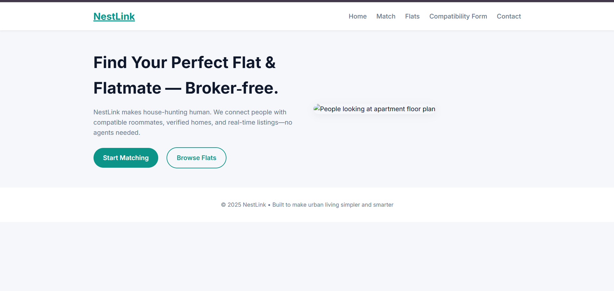

# Frontend Mentor - Blog Preview Card Solution

This is my solution to the [Blog Preview Card Challenge](https://www.frontendmentor.io/challenges/blog-preview-card-ckPaj01IcS) on Frontend Mentor. This project helped me practice responsive layouts, semantic HTML, and CSS styling with a focus on modern card UI.

## Table of Contents

- [Overview](#overview)
  - [The Challenge](#the-challenge)
  - [Screenshot](#screenshot)
  - [Links](#links)
- [My Process](#my-process)
  - [Built With](#built-with)
  - [What I Learned](#what-i-learned)
  - [Continued Development](#continued-development)
- [Author](#author)

---

## Overview

### The Challenge

Users should be able to:

- View the blog preview card layout
- See hover and focus states for all interactive elements
- Experience a responsive layout on mobile (375px) and desktop (1440px)

### Screenshot



### Links

- 🔗 [Live Site](https://asthaaaaa07.github.io/blog-preview-card/)
- 💻 [Solution on Frontend Mentor](https://www.frontendmentor.io/solutions/blog-preview-card-using-html-css-flexbox-mobile-responsive-xyz123) <!-- Update this with your real solution link -->

---

## My Process

### Built With

- Semantic **HTML5**
- **CSS3** custom properties
- **Flexbox**
- **Mobile-first** workflow
- Media Queries for responsiveness

### What I Learned

During this project, I gained more confidence in:

- Structuring semantic HTML with clarity
- Using `object-fit: cover` for responsive images
- Creating responsive layouts using `max-width` and `media queries`
- Applying consistent spacing with `gap`, `margin`, and `padding`

Here’s a snippet I liked:

```css
.article img {
  width: 100%;
  height: 100%;
  object-fit: cover;
  display: block;
}
